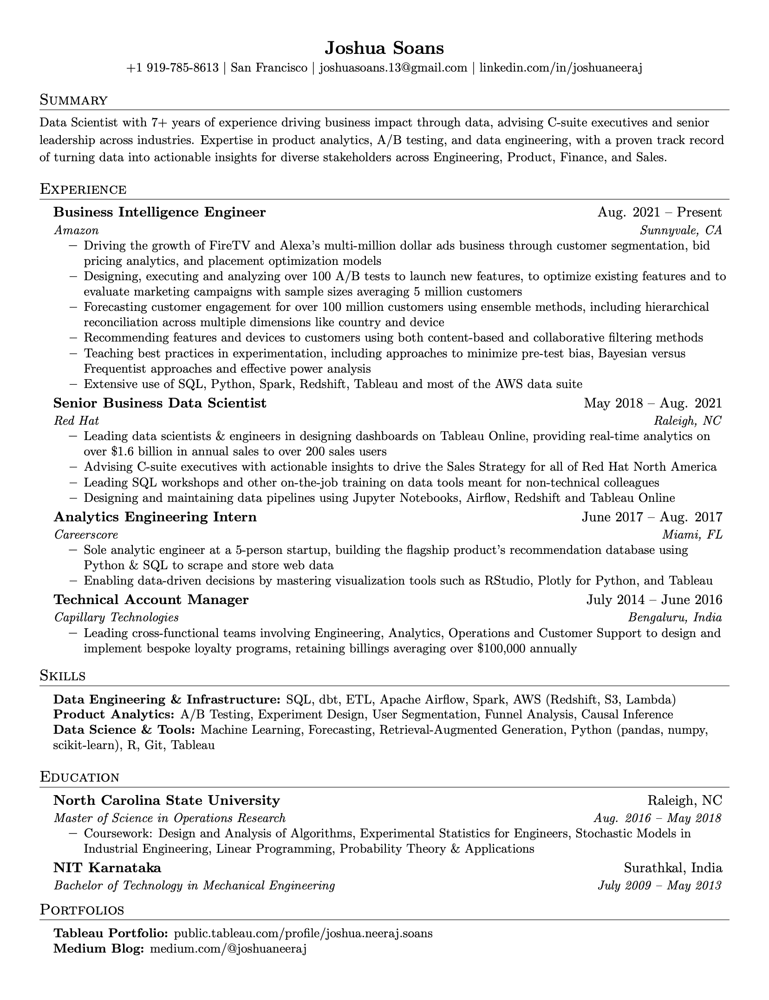

# Resume on Plotly

A clean, modern visualization of a LaTeX resume using Plotly Dash. This application presents professional experience, education, and skills in a well-organized web format, featuring radar charts for skills visualization.

<table style="border-collapse: collapse;">
<tr>
<th width="50%" style="border: none;">Before: Traditional LaTeX Resume</th>
<th width="50%" style="border: none;">After: Modern Web Visualization</th>
</tr>
<tr>
<td width="50%"></td>
<td width="50%"></td>
</tr>
</table>

## Development

This project was developed entirely with the assistance of Claude (via Cursor), an AI coding assistant. The initial prompt was simple: "Create a web-based visualization of my LaTeX resume using Plotly Dash, with radar charts to display skills in a modern, clean format."

Using Cursor as the IDE and Claude as the pair programming assistant, we:
- Converted a LaTeX resume into a structured web application
- Implemented radar charts using Plotly for skills visualization
- Built a responsive layout using Dash Bootstrap Components
- Created a clean, professional design with company branding
- Set up proper documentation and GitHub repository

The entire development process, from initial concept to final deployment, demonstrates the potential of AI-assisted development in creating professional web applications.

## Quick Start (macOS)

1. Open Terminal
2. Clone this repository (if you haven't already):
   ```bash
   git clone git@github.com:joshuaneeraj/resume-visualizer.git
   cd resume-visualizer
   ```

3. Run the dashboard:
   ```bash
   chmod +x run.sh  # Make the script executable (only needed first time)
   ./run.sh
   ```

4. Open your browser and visit: http://127.0.0.1:8050

The `run.sh` script will:
- Create a Python virtual environment (if it doesn't exist)
- Install all required packages
- Start the dashboard
- Clean up when you exit (Ctrl+C)

## Manual Setup (if needed)

If you prefer to set things up manually:

1. Create and activate a virtual environment:
   ```bash
   python3 -m venv venv
   source venv/bin/activate
   ```

2. Install requirements:
   ```bash
   python3 -m pip install -r requirements.txt
   ```

3. Run the dashboard:
   ```bash
   python3 app.py
   ```

## Project Structure

```
resume-visualizer/
├── app.py                      # Main application code
├── requirements.txt            # Python dependencies
├── run.sh                     # Startup script
├── raw-data/                  # Input data directory
│   └── skills.json            # Skills data
└── assets/                    # Static assets
    ├── custom.css             # Custom styling
    └── images/                # Logo images
        ├── dp.jpeg            # Profile picture
        ├── experience1.jpeg   # Most recent experience
        ├── experience2.jpeg   # Second most recent
        ├── school1.jpeg       # Most recent education
        ├── school2.jpeg       # Second most recent
        └── nologo.jpeg        # Default logo
```

## Image Configuration

Images should be placed in the `assets/images/` directory following this naming convention:
- Profile picture: `dp.jpeg`
- Company logos: `experience1.jpeg`, `experience2.jpeg`, etc. (1 being most recent)
- Institution logos: `school1.jpeg`, `school2.jpeg`, etc. (1 being most recent)
- Default logo: `nologo.jpeg` (used when specific logo is not found)

## Troubleshooting

1. **Permission Denied when running run.sh**
   ```bash
   chmod +x run.sh
   ```

2. **Port 8050 Already in Use**
   ```bash
   # Find and kill the process using port 8050
   lsof -i :8050
   kill -9 <PID>
   ```

3. **Python Version**
   - This application requires Python 3.8 or newer
   - Check your version: `python3 --version`

## Features

- **Clean Layout**: Professional presentation of experience, education, and skills
- **Skills Visualization**: 
  - Radar charts showing skill categories
  - Clear organization of technical competencies
- **Bootstrap-based Design**: Built with Bootstrap components for consistent styling
- **Profile Section**: Compact header with photo and contact information
- **Company Branding**: Logo integration for companies and institutions

## Contributing

Feel free to fork this repository and adapt it for your own resume or portfolio! If you make improvements to the codebase, please consider submitting a pull request. We welcome contributions that enhance functionality, improve documentation, or fix bugs.

## License

This project is licensed under the MIT License - see below for details:

```
MIT License

Copyright (c) 2024 Joshua Soans

Permission is hereby granted, free of charge, to any person obtaining a copy
of this software and associated documentation files (the "Software"), to deal
in the Software without restriction, including without limitation the rights
to use, copy, modify, merge, publish, distribute, sublicense, and/or sell
copies of the Software, and to permit persons to whom the Software is
furnished to do so, subject to the following conditions:

The above copyright notice and this permission notice shall be included in all
copies or substantial portions of the Software.

THE SOFTWARE IS PROVIDED "AS IS", WITHOUT WARRANTY OF ANY KIND, EXPRESS OR
IMPLIED, INCLUDING BUT NOT LIMITED TO THE WARRANTIES OF MERCHANTABILITY,
FITNESS FOR A PARTICULAR PURPOSE AND NONINFRINGEMENT. IN NO EVENT SHALL THE
AUTHORS OR COPYRIGHT HOLDERS BE LIABLE FOR ANY CLAIM, DAMAGES OR OTHER
LIABILITY, WHETHER IN AN ACTION OF CONTRACT, TORT OR OTHERWISE, ARISING FROM,
OUT OF OR IN CONNECTION WITH THE SOFTWARE OR THE USE OR OTHER DEALINGS IN THE
SOFTWARE.
``` 